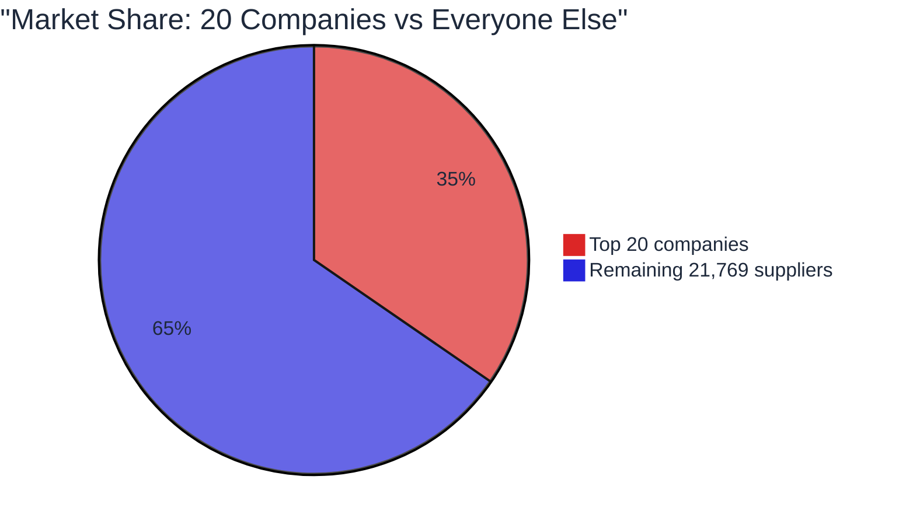
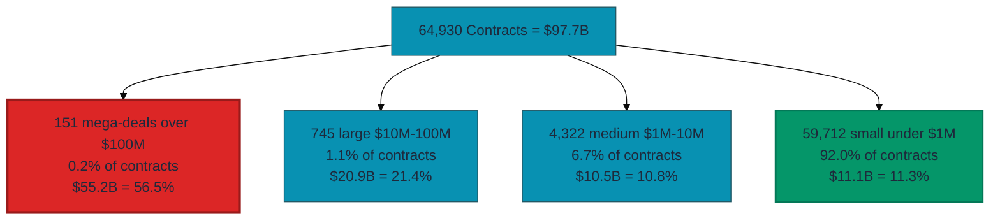
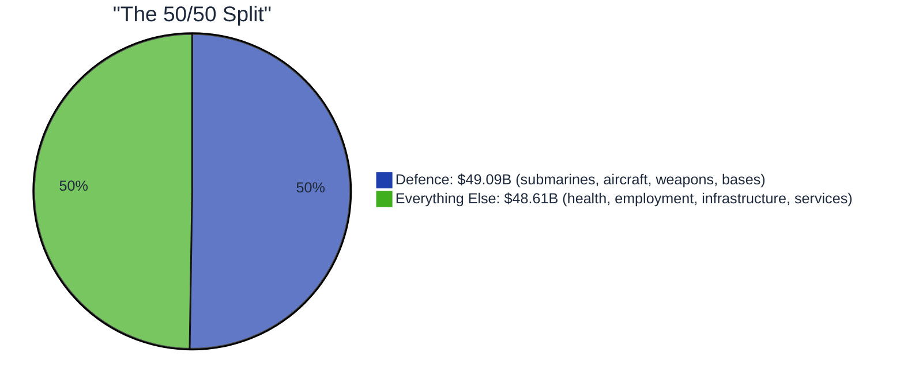
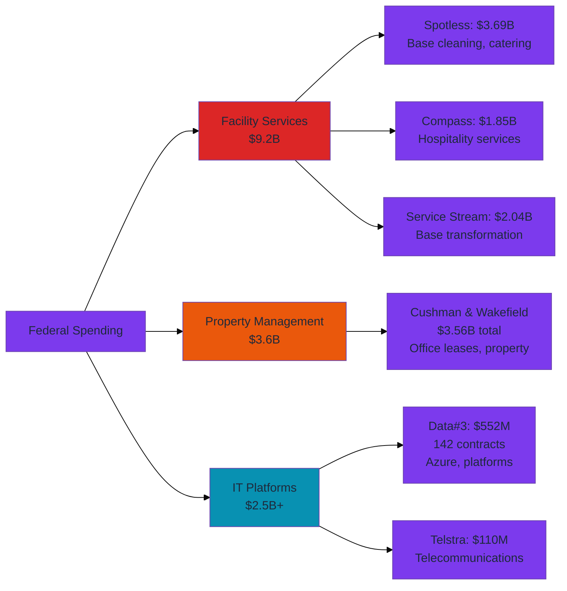
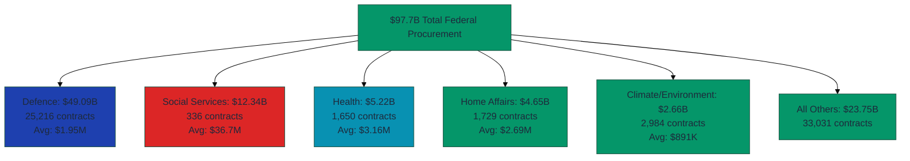
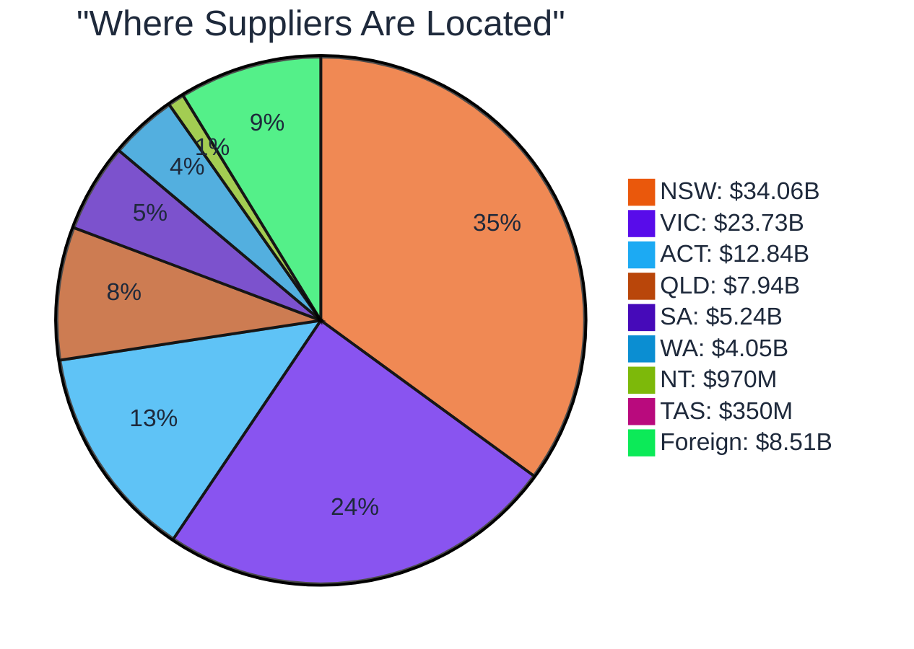

# Inside $97.7 Billion: Federal Procurement Contracts Awarded in 2025

In 2025, the Australian Federal Government spent $97,692,769,058 on contracts with private companies. Across 64,930 contracts with 21,789 different suppliers.

I analyzed every contract to see where the money actually went. Here's what I found.

**Important:** This analysis covers procurement contracts only - it excludes social security payments (pensions, NDIS, Centrelink), Medicare, grants, state transfers, and public service salaries. Contract values shown are maximum amounts over the contract life (which may span multiple years), not annual expenditure. For total government spending, see [Budget Papers](https://budget.gov.au).

**Important Note on Supplier Counting:**

Supplier figures are based on exact legal entity names as recorded in AusTender. Large corporations with multiple subsidiaries (e.g., Thales Australia, Thales Australia Limited, Thales Australia - Lithgow) are counted separately as they are distinct legal entities with separate ABNs.

This means actual corporate group concentration may be higher than reported. For example, the Thales corporate family received $329M across 656 contracts through 16 separate entities, though only "THALES AUSTRALIA" ($248M, 474 contracts) appears in rankings.

Similar patterns exist for other corporate groups with multiple legal entities.

---

## The Concentration Story

Twenty companies captured $33.83 billion - nearly the same amount as the remaining 21,769 suppliers combined.

But the real concentration emerges when you look at contract size. Just 151 contracts over $100 million captured 56.5% of all spending - more than half the total market.

The pattern is clear: fewer contracts mean more money. The 151 mega-deals averaged $365 million each. The 59,712 small contracts averaged $186,000.

This isn't a competitive marketplace in the traditional sense. It's a system where massive deals dominate while tens of thousands of smaller transactions operate in their shadow.

---

## One Contract vs Four Hundred Seventy-Four

The concentration statistics tell only part of the story. Suppliers are playing two completely different games in the same market.

**The Lottery Play:** Spotless Facility Services won 1 contract worth $3.69 billion for comprehensive facility management at Defence bases - cleaning, catering, security, maintenance, firefighting, and base operations over 6 years. One massive win.

**The Volume Play:** Thales Australia won 474 contracts worth $247.65 million. They didn't chase the mega-deal. They accumulated small victories month after month across Defence, Home Affairs, and other agencies.

Here's the comparison:

| Strategy | Supplier | Contracts | Total Value | Average | Market Share |
|----------|----------|-----------|-------------|---------|--------------|
| **Lottery** | Spotless Facility Services | 1 | $3,690,000,000 | $3.69B | 3.78% |
| **Volume** | Thales Australia | 474 | $247,650,000 | $522K | 0.25% |

Spotless captured 14.9 times more value with 1/474th the number of contracts. Thales had to win 474 times to reach 6.7% of what Spotless secured in a single deal.

Neither approach is superior. They're fundamentally different business models operating within the same procurement system. Both generated hundreds of millions in revenue. Both serve government needs. They just operate on radically different scales.

---

## The Defence Reality

Before diving deeper into the patterns, there's an obvious fact: the Department of Defence spent $49.09 billion across 25,216 contracts - exactly half of all federal procurement.

This isn't surprising. Australia maintains submarines, aircraft, sophisticated weapons systems, and extensive military infrastructure. Defence procurement operates on a different scale than civilian agencies.

But the concentration patterns, supplier strategies, and outsourcing behaviors visible in the remaining $48.6 billion reveal how the entire system actually works. That's where this analysis focuses.

---

## What We Actually Bought

The procurement data reveals something most Australians don't see: how government actually delivers services.

### The Employment Services Model

Department of Social Services spent $12.34 billion - second only to Defence - but did so through just 336 contracts. Average: $36.7 million per contract.

If you've ever been to Centrelink and been sent to a job services provider, this is where that money comes from:

| Provider | Contracts | Total Value | What They Do |
|----------|-----------|-------------|--------------|
| Serendipity (WA) | 2 | $1.40B | Employment services, disability support |
| Atwork Australia | 2 | $1.19B | Job placement programs |
| Sureway Employment | 2 | $910M | Employment training and placement |
| Wise Employment | 2 | $810M | Employment programs |
| Others | 328 | $8.02B | Various social service delivery |

Government doesn't run these programs directly. It funds private and non-profit organizations to deliver employment services, disability support, and community programs at scale through massive multi-year commitments.

This is fundamentally different from Defence, which awarded 25,216 smaller contracts. Social Services makes rare, enormous funding commitments. Different mission, radically different procurement model.

### The Services You Actually See

Ever wondered who maintains government buildings, runs call centers, or manages Defence bases?

These aren't small contracts. Facility services - cleaning, catering, security, maintenance - consumed $9.2 billion. Property management for government buildings cost $3.6 billion. IT platforms and infrastructure: at least $2.5 billion.

Government has largely outsourced operational services to private contractors through long-term, high-value agreements.

### Health Services People Interact With

Department of Health spent $5.22 billion across 1,650 contracts. This is the pharmaceuticals you get from the pharmacy, medical equipment in hospitals, research grants finding new treatments:

**Major Health Spending:**
- Pharmaceutical funding pools: $1.8B+ (Sigma Healthcare, API Services, Symbion)
- Medical equipment and supplies: Scattered across hundreds of contracts
- Research grants: Universities and research institutions
- Healthcare IT systems: Patient management, data systems

Unlike Social Services' massive funding commitments, Health makes constant medium-sized purchases for operational needs.

---

## The Repeat Winner Effect

Of 21,789 unique suppliers, 13,389 (61.4%) won exactly one contract in 2025. They competed, won, delivered, and disappeared from the data.

The remaining 8,400 suppliers (38.6%) won multiple contracts. This is where the pattern becomes interesting.

**The Volume Champions:**

| Supplier | Contracts Won | Total Value | Average | Primary Sector |
|----------|---------------|-------------|---------|----------------|
| Thales Australia | 474 | $247.65M | $522K | Defence, Technology |
| Jones Lang LaSalle ACT | 400 | $146.34M | $366K | Property Management |
| Aurecon Australasia | 317 | $191.35M | $604K | Engineering |
| Telstra Secure Billing | 282 | $110.32M | $391K | Telecommunications |
| Dell Australia | 262 | $102.63M | $392K | IT Equipment |

Five suppliers won more contracts individually than entire government departments awarded. Thales won 474 contracts. Department of Social Services awarded 336 total.

Once you're established with agencies - once you've delivered successfully, once you're on approved supplier panels - winning becomes substantially easier. The data shows this clearly: repeat winners dominate certain procurement categories while newcomers struggle to break in.

---

## The Consulting Question

Consulting firms generated substantial revenue from federal contracts in 2025:

| Firm | Contracts | Total Value |
|------|-----------|-------------|
| KPMG | 199 | $91.88M |
| Clayton Utz (legal) | 249 | $60.56M |
| Maddocks (legal) | 137 | $31.56M |
| Aurecon (engineering/advisory) | 317 | $191.35M |

This raises the perennial question: why does government pay external consultants while employing thousands of public servants?

The answer lies in the data. Consulting spend concentrates in specialized areas:

- **Legal services** (litigation, contracts, regulatory advice)
- **Engineering and technical advisory** (infrastructure, systems design)
- **Strategic advice** (policy, transformation, digital)
- **Audit and compliance** (financial, risk, assurance)

These are often project-based needs requiring specialized expertise government doesn't maintain in-house. Whether this represents value for money or excessive outsourcing depends on your perspective.

---

## Where The Money Actually Went

Looking at agencies reveals different procurement behaviors:

**Different agencies, different models:**

- **Social Services:** Rare, massive funding commitments ($36.7M average)
- **Defence:** High volume plus mega-deals ($1.95M average)
- **Health:** Constant medium-sized procurement ($3.16M average)
- **Home Affairs:** Mix of IT systems and operational contracts ($2.69M average)

The procurement system isn't uniform. It varies dramatically by agency mission and operational model.

---

## The Geographic Reality

Federal procurement doesn't distribute evenly across Australia.

NSW and Victoria combined capture 59.2% of all federal contract value. This reflects where defence contractors, technology firms, and major service providers maintain their headquarters. It also shows where government maintains substantial office presence beyond Canberra, generating demand for property management, IT services, and professional services.

Tasmania receives 0.36% of federal procurement value. Northern Territory receives 0.99%. These aren't arbitrary choices - they reflect where suppliers locate and where government operations concentrate.

---

## The Competition Question

Not all procurement goes through open competition.

| Method | Contracts | % Count | Total Value | % Value |
|--------|-----------|---------|-------------|---------|
| **Open Tender** | 27,424 | 42.2% | $61.15B | 62.6% |
| **Limited Tender** | 37,459 | 57.7% | $36.52B | 37.4% |
| **Selective** | 47 | 0.1% | $20M | 0.02% |

By contract count, limited tender actually dominates at 57.7%. But these are smaller contracts averaging $975,000 compared to $2.23 million for open tender.

**37.4% of spending - $36.52 billion - was awarded through limited tender.** This means restricted competition or no competition at all.

Limited tender isn't always problematic. Some contracts require specialized capabilities only one supplier possesses. Defence and security contracts restrict competition for obvious reasons. Extensions of existing contracts avoid costly re-tendering. Emergency procurements demand speed over process.

But 37.4% means more than a third of federal spending bypassed full open competition. Whether this represents efficient procurement or inadequate competition depends on individual contract circumstances not visible in the data.

---

## The Platform Lock-In Story

Some contracts aren't just purchases - they're decade-long commitments to technology ecosystems that create dependencies and generate downstream opportunities.

**Major Platform Decisions:**

| Platform | Primary Contract | Value | Implications |
|----------|-----------------|-------|--------------|
| **Microsoft Azure** | Data#3 | $500M over 5 years | Commits government to Microsoft cloud through 2030 |
| **Salesforce** | Various agencies | Tens of millions | CRM platform creating implementation opportunities |
| **ServiceNow** | Various agencies | Tens of millions | IT service management, partner ecosystem |

Data#3 didn't just win the Azure contract. They won 142 total contracts worth $552.58 million - an average of $3.89 million each. They positioned themselves as implementation partners for major technology platforms, winning multiple related contracts as those platforms rolled out.

The pattern: government makes rare, large platform decisions. Those decisions then generate dozens of smaller implementation, customization, and support contracts over following years. Once locked into an ecosystem, switching becomes prohibitively expensive.

This is why you can't easily change government IT systems. The dependencies run deep.

---

## The Scale Most People Miss

Abstract billions don't register emotionally. Here's what $97.7 billion actually means:

**Daily rate:** Federal government awarded $268 million in contracts every day in 2025. Every hour: $11 million. Every 8-hour workday: $88 million.

**Comparative scale:**
- Total federal procurement ($97.7B) = 14% of entire federal budget (~$700B)
- Defence procurement ($49B) = More than Australia spends on higher education annually
- Employment services ($12.0B) = More than federal spending on arts, ABC, SBS combined

**If federal procurement was a year:**
- January 1 - June 30: Defence spending ($49B)
- July 1 - December 31: Everything else ($48.6B)

**Individual contract scale:**
- Spotless contract ($3.69B) = 3.78% of all federal procurement
- Employment services ($11.89B) = 12.17% of all spending
- Top 4 consulting firms (~$375M) = 0.38% of spending

These numbers represent public money flowing to private companies for services government has chosen not to deliver directly.

---

## Top 20 Contract Recipients

These are the companies that captured the most federal money in 2025:

| Rank | Supplier | Total Value | Contracts | Primary Services |
|------|----------|-------------|-----------|------------------|
| 1 | Spotless Facility Services | $3.69B | 1 | Base support services (cleaning, catering, security) |
| 2 | Navantia Australia | $2.48B | 60 | Naval engineering, ship sustainment |
| 3 | Service Stream Infrastructure | $2.04B | 1 | Base services transformation |
| 4 | Anduril Australia | $1.88B | 5 | Autonomous undersea vehicles |
| 5 | Riverina Redevelopment JV | $1.89B | 5 | Redevelopment project support |
| 6 | Compass Group Defence | $1.85B | 1 | Hospitality and catering services |
| 7 | Viva Energy Australia | $1.55B | 67 | Fuel supply |
| 8 | Cushman & Wakefield (combined) | $3.56B | 75 | Property management, leases |
| 9 | Serendipity (WA) | $1.40B | 2 | Employment and disability services |
| 10 | BAE Systems Australia | $1.31B | 53 | Defence capability services |
| 11 | Boeing Defence Australia | $1.21B | 92 | Defence systems and support |
| 12 | MSS Security | $1.19B | 1 | Base services security |
| 13 | Atwork Australia | $1.19B | 2 | Employment services |
| 14 | API Services Australia | $1.19B | 2 | Pharmaceutical funding pool |
| 15 | Toll Remote Logistics | $933M | 189 | Logistics services |
| 16 | Sureway Employment | $910M | 2 | Employment training and placement |
| 17 | Wise Employment | $810M | 2 | Employment programs |
| 18 | Evolve FM | $790M | 1 | Lease rental costs (25 years) |
| 19 | ASC Pty Ltd | $660M | 1 | Submarine sustainment |
| 20 | Sigma Healthcare | $640M | 1 | Pharmaceutical funding pool |

Notice the pattern: Defence contractors, facility services, employment service providers, and property managers dominate. These aren't manufacturers or product companies. They're service delivery organizations operating government programs and maintaining government infrastructure.

---

## What The Data Reveals

After analyzing all 64,930 contracts, several patterns emerge:

**Extreme concentration exists at multiple levels.** Defence accounts for 50% of spending. The top 20 companies captured 35% of the market. Just 151 mega-deals represent 56.5% of total value. This isn't normal distribution - it's concentration at every scale.

**Two fundamentally different business models coexist.** Some suppliers chase decade-defining mega-deals (Spotless's $3.69B). Others accumulate hundreds of smaller contracts (Thales's 474 wins). Both strategies generate substantial revenue. They operate on completely different scales but serve the same system.

**Government has largely outsourced operational services.** Facility services ($9.2B), property management ($3.6B), employment programs ($12.0B), IT platforms ($2.5B+). Private companies now deliver services government once provided directly. Whether this represents efficiency or loss of capability depends on perspective.

**Repeat business dominates.** Once established with agencies, suppliers win repeatedly. The highest-volume winner secured 474 contracts. Multiple suppliers won 100+ contracts each. Breaking into federal procurement is difficult. Staying in appears substantially easier.

**Agencies behave fundamentally differently.** Social Services awards few massive contracts. Defence awards many contracts at all scales. Health makes constant medium-sized purchases. The procurement system varies dramatically by agency mission.

**Geography concentrates predictably.** NSW and Victoria capture 59% of contract value. This reflects supplier headquarters locations and government office concentrations. Remote states see far less procurement activity regardless of population.

**Competition isn't universal.** 37% of spending ($36.5B) was awarded through limited tender, bypassing full open competition. This includes specialized requirements, security considerations, contract extensions, and other circumstances where open tender wasn't used.

---

## The Numbers

**Total procurement:** $97,692,769,058  
**Total contracts:** 64,930  
**Unique suppliers:** 21,789  
**Largest contract:** $3,690,000,000 (Spotless - base support services)

**Market concentration:**  
- Top 1 company: 3.78% of market
- Top 5 companies: 15.19% of market
- Top 20 companies: 34.63% of market
- Top 151 mega-deals (>$100M): 56.47% of market

**Agency spending:**  
- Defence: $49.09B (50.25%) - 25,216 contracts
- Social Services: $12.34B (12.63%) - 336 contracts
- Health: $5.22B (5.34%) - 1,650 contracts
- Home Affairs: $4.65B (4.76%) - 1,729 contracts

**Geographic distribution:**  
- NSW: 34.86% ($34.06B)
- Victoria: 24.29% ($23.73B)
- ACT: 13.14% ($12.84B)
- Queensland: 8.13% ($7.94B)

**Competition metrics:**  
- Open tender: 62.6% by value ($61.15B)
- Limited tender: 37.4% by value ($36.52B)

**Supplier concentration:**  
- Single contract only: 13,389 suppliers (61.4%)
- Multiple contracts: 8,400 suppliers (38.6%)
- Highest volume: 474 contracts (Thales Australia)

---

## About This Analysis

This report analyzed the complete AusTender federal contracts register for 2025, covering all publicly disclosed contract awards from January through December.

**Data source:** AusTender Federal Contracts Register via OCDS API  
**Contracts analyzed:** 64,930  
**Coverage:** All federal departments and agencies  
**Data points:** Contract ID, supplier name, procuring entity, contract value, dates, procurement method, supplier location

**Methodology:** Quantitative analysis of contract values, supplier patterns, agency behavior, and market concentration. Statistical analysis of repeat winners, geographic distribution, and competition metrics.

**Limitations:** This analysis examines contract awards, not performance, compliance, or outcomes. Subcontracting relationships, bid participation rates, procurement processes, and classified elements of Defence contracts are not visible in public data. Supplier country registration may not reflect ultimate ownership (e.g., Boeing Defence Australia registers as Australian but is U.S.-owned).

---

## Final Observation

Federal procurement isn't what most Australians imagine. It's not thousands of competitive contracts creating a fair marketplace. It's a concentrated system where Defence dominates everything, mega-deals capture most spending, and a relatively small number of suppliers win repeatedly.

The $97.7 billion funded submarines and employment programs, facility services and consulting advice, IT platforms and pharmaceutical pools. Some of it went through competitive processes. Some bypassed competition entirely. Some funded single massive contracts. Some funded hundreds of small purchases.

The market contains multitudes: strategic weapons systems and office cleaning, decade-long commitments and annual renewals, $3.69 billion facility contracts and $25,000 consulting engagements. Understanding it requires moving beyond averages and totals to see the concentration patterns, supplier strategies, and agency behaviors hiding in the details.

This is what $97.7 billion in public spending actually looks like.

---

## 💬 Feedback & Discussion

Found an error? Have insights to share? Want to request analysis?

**Ways to engage:**

1. **GitHub Issues** - [Report errors or suggest improvements](https://github.com/taxpayer-money/australian-government-contracts/issues)
2. **GitHub Discussions** - [Share insights or ask questions](https://github.com/taxpayer-money/australian-government-contracts/discussions)
3. **Data Corrections** - Found a discrepancy? Include contract ID for verification

**Found something interesting in the data?**
- Build on it (CC0 license - no attribution required)
- Share your analysis - we'd love to see it
- Tag the repo if you write about it

---

## ⭐ Support This Work

If you find this useful:
- ⭐ **Star this repo** on GitHub (helps others discover it)
- 🔄 **Share** with journalists, researchers, policy advocates
- 📊 **Build on it** - the data is yours to use
- 🐛 **Report issues** - data quality matters

---

*Analysis completed January 2026*  
*Data: AusTender Federal Contracts Register 2025*  
*Analyzed: 64,930 contracts across 21,789 suppliers*

 

