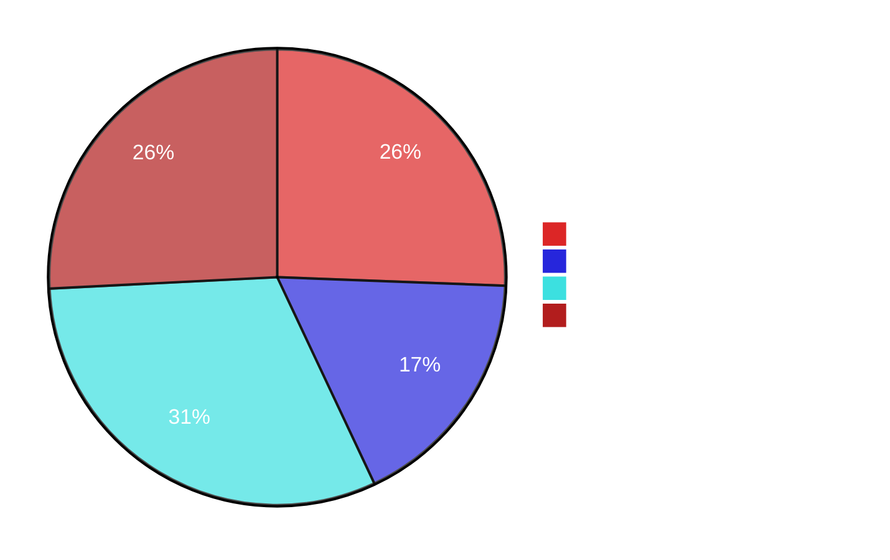
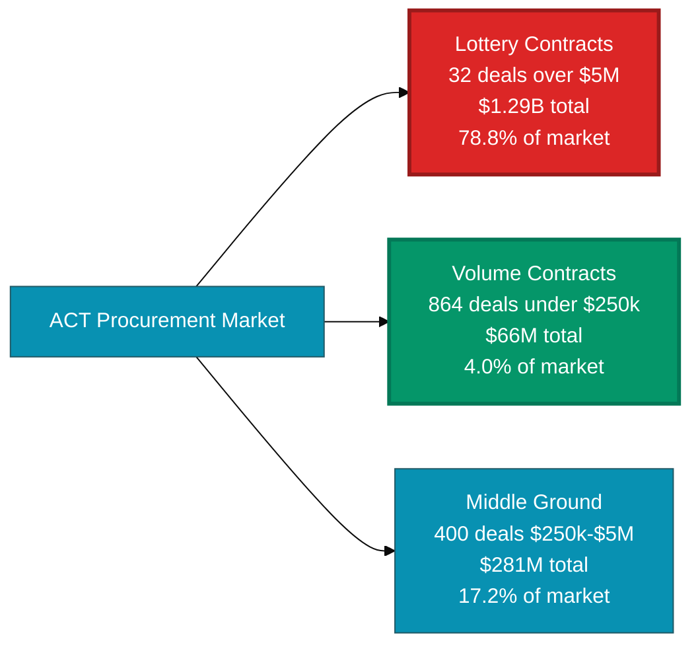

# Inside $1.64 Billion: The Story of ACT Government Spending in 2025

In 2025, the ACT Government awarded 1,296 contracts worth $1,639,045,607. That's $1.64 billion flowing from public coffers to 772 different suppliers, spanning everything from hospital ventilators to entire fleet management systems.

I analyzed every single contract. Here's what the data reveals.

---

## The Concentration Story

Two contracts accounted for 43% of all government spending in 2025.

Let me repeat that: **two contracts out of 1,296 captured $705 million** - nearly half the total market.

The first was awarded to SG Fleet Australia in October - a $420 million whole-of-government vehicle fleet management agreement. That single contract represented 25.6% of everything the ACT Government procured in 2025.

The second went to Veolia Environmental Services for $285 million in waste management services. Another 17.4% of the market.

Together, these two suppliers won nothing else. No additional contracts, no smaller deals to pad their numbers. Just two massive agreements that dwarfed everything else.

The pattern continues when you zoom out. The top 20 contracts - just 1.5% of all awards - accounted for $1.22 billion, or 74.2% of total spending. The remaining 1,276 contracts shared what was left: $424 million, or 25.8%.

This isn't a competitive marketplace in the traditional sense. It's a market where a handful of mega-deals completely dominate the landscape, while hundreds of smaller transactions operate in the shadows of these giants.

---

## One Contract vs Thirty-Five: Two Different Games

The concentration statistics mask an interesting truth: suppliers are playing two completely different games in the same market.

**The Lottery Play:** SG Fleet won one contract worth $420 million. They competed once (probably against 3-5 other qualified firms), and won. That single victory likely took years of relationship building, months of bid preparation, and substantial upfront investment. The payoff? Nearly half a billion dollars over what's probably a 7-10 year agreement.

**The Volume Play:** Paragon Care Australia won 35 contracts worth a combined $1.58 million. Average contract value: $45,278. They didn't compete for any mega-deals. Instead, they won contract after contract, month after month, accumulating small victories that added up.

Here's the comparison:

| Approach | Supplier | Contracts | Total Value | Average Value | Market Share |
|----------|----------|-----------|-------------|---------------|--------------|
| Lottery | SG Fleet | 1 | $420,000,000 | $420,000,000 | 25.6% |
| Volume | Paragon Care | 35 | $1,584,714 | $45,278 | 0.1% |

SG Fleet captured 265 times more value with 1/35th the number of contracts. Paragon Care had to win 35 times to reach less than 0.4% of what SG Fleet secured in a single deal.

Neither approach is inherently superior. They're fundamentally different business models operating within the same procurement system. SG Fleet specializes in winning once-per-decade mega-opportunities. Paragon Care built a business on consistent, repeated small wins.

The market accommodates both.

---

## The Duration Multiplier

Multi-year contracts are worth 13.9 times more than single-year contracts on average.

This isn't a small difference. It's not even a significant difference. It's a structural feature of how government values long-term commitments.

Consider the extremes:

**Veolia's waste management contract:** 23.2 years, $285 million. The government essentially locked in waste services until 2048. In exchange, they paid a massive premium for that certainty.

**Omexom's streetlight contract:** 7 years, $107 million. Every streetlight in the ACT, maintained by one company for nearly a decade.

Of the 10 longest contracts awarded in 2025 (all exceeding 5 years), their combined value was $405 million - an average of $40.5 million each. Single-year contracts averaged $2.9 million.

The pattern is clear: duration isn't just a timeline - it's a value multiplier. The government pays substantially more for agreements that span years rather than months.

---

## The Volume Champions

While SG Fleet and Veolia dominated by value, another group of suppliers dominated by activity.

The highest-volume winner was Paragon Care with 35 contracts. But they weren't alone:

| Supplier | Contracts Won | Total Value | Average | Primary Sector |
|----------|---------------|-------------|---------|----------------|
| Paragon Care Australia | 35 | $1,584,714 | $45,278 | Health |
| BD | 30 | $5,865,099 | $195,503 | Health |
| Medtronic Australasia | 26 | $1,725,956 | $66,383 | Health |
| Haines Medical Australia | 21 | $9,492,030 | $452,001 | Health |
| Cepheid Holdings | 21 | $826,658 | $39,365 | Health |

Notice the pattern? All five work primarily with Canberra Health Services.

This wasn't coincidental. Health Services awarded 545 contracts in 2025 - 42% of all government contract activity. The median contract value was $35,342. The average was $182,775.

Compare this to Infrastructure Canberra, which awarded just 64 contracts averaging $7.5 million each. Infrastructure spent $482 million across those 64 awards. Health spent $100 million across 545.

Two directorates, two completely different procurement behaviors. Infrastructure makes rare, large commitments. Health makes constant, small purchases.

The volume champions understood which game to play.

---

## When Money Moves

Spending wasn't evenly distributed across 2025. Not even close.

October saw $604 million in contract awards - 36.9% of the entire year compressed into 30 days. To put that in perspective, the average month saw $132 million. October was 4.6 times higher.

Here's how the year actually unfolded:

| Month | Contracts | Total Value | % of Year |
|-------|-----------|-------------|-----------|
| January | 79 | $325,171,055 | 19.8% |
| February | 85 | $41,281,758 | 2.5% |
| March | 88 | $38,405,052 | 2.3% |
| April | 96 | $50,821,816 | 3.1% |
| May | 98 | $40,662,041 | 2.5% |
| June | 107 | $132,410,573 | 8.1% |
| July | 112 | $123,613,488 | 7.5% |
| August | 124 | $14,863,232 | 0.9% |
| September | 138 | $145,400,451 | 8.9% |
| **October** | **130** | **$604,263,190** | **36.9%** |
| November | 122 | $69,088,085 | 4.2% |
| December | 117 | $53,064,866 | 3.2% |

January and October together accounted for 56.7% of annual spending. The fourth quarter (October through December) captured 44.3% of the year's total contract value.

But the temporal pattern goes deeper than monthly totals. Awards clustered on specific dates:

- **August 1st:** 38 contracts awarded
- **July 1st:** 24 contracts awarded
- **December 18th:** 13 contracts awarded

These weren't coincidences. They reveal batch processing - contracts approved over weeks or months, then formally awarded on specific administrative dates. The award date reflects when paperwork was finalized, not necessarily when decisions were made.

---

## The Directorate Divide

The ACT Government isn't a monolith. It's a collection of directorates, each with distinct procurement personalities.

**Chief Minister, Treasury and Economic Development** spread $518 million across 109 contracts. Average: $4.75 million. This is where whole-of-government initiatives live - the fleet contract, major IT platforms, strategic economic investments.

**Infrastructure Canberra** awarded 64 contracts worth $482 million. Average: $7.5 million per contract - the highest average of any directorate. This is construction, roads, utilities, and major capital works.

**Canberra Health Services** operated completely differently. They awarded 545 contracts worth $100 million. Average: $182,775. Median: $35,342. This represents constant operational procurement - medical supplies, equipment, consumables purchased month after month.

**Digital Canberra** made the fewest awards (just 10 contracts) but with massive average value: $4.8 million each. Total spending: $48 million on enterprise platforms. Salesforce captured $23.1 million. ServiceNow secured $15.4 million. These weren't purchases - they were multi-year platform commitments.

The variance between directorates is extreme:

| Directorate | Contracts | Total Value | Average | Ratio* |
|-------------|-----------|-------------|---------|--------|
| Infrastructure | 64 | $481,685,653 | $7,526,339 | 5.0 |
| Digital | 10 | $48,050,155 | $4,805,016 | - |
| Chief Minister | 109 | $518,264,716 | $4,754,722 | 8.5 |
| Health Services | 545 | $99,612,621 | $182,775 | 4.3 |

*Variance ratio: standard deviation ÷ mean (higher = more inconsistent contract sizes)

Infrastructure and Chief Minister show high variance - they award both massive contracts and smaller ones. Health Services shows lower variance - their contracts cluster around consistent sizes.

---

## Patterns in Repetition

Some suppliers won once. Others won repeatedly.

Data#3 Limited won 15 contracts worth $11.4 million - average of $759,267 each. They positioned themselves as implementation partners for major technology platforms, winning multiple related contracts as those platforms rolled out.

Haines Medical Australia secured 21 contracts totaling $9.5 million. They weren't chasing mega-deals. They were winning consistent business with Health Services month after month.

The repeat winners reveal something about how government procurement actually works. Once you're known to an agency, once you've delivered successfully, you're more likely to be invited to participate in future procurements. The data shows this clearly:

**First-time winners:** Average 1.68 contracts each  
**Suppliers with 5+ contracts:** Average 14.4 contracts each

The gap is enormous. Breaking in is hard. Staying in, once you're there, appears substantially easier.

---

## The Platform Investments

Buried in the data are several contracts that signal strategic direction rather than operational need.

**Salesforce: $23.1 million** - A whole-of-government CRM platform. Not a purchase, but a 3-year enterprise commitment to reshape how ACT agencies manage relationships and data.

**ServiceNow: $15.4 million** - IT service management for the entire territory. Again, not just software - a foundational platform decision with multi-year implications.

These platform contracts create downstream opportunities. Implementation partners followed: Data#3 won 15 contracts. Datacom secured 10. SFDC Australia (a Salesforce partner) won $4 million in implementation work.

The pattern: government makes rare, large platform decisions. Those decisions then generate dozens of smaller implementation, customization, and support contracts over the following years.

---

## The Construction Pipeline

Infrastructure Canberra's $482 million reveals substantial construction activity:

**Major Projects (>$20M):**
- Design & Construction project: $87.5M (Icon SI)
- William Hovell Drive upgrade: $66.0M (Canberra Contractors)
- Community housing development: $46.2M (Hindmarsh Construction)
- Acton Waterfront development: $24.8M (Complex Co.)

**Mid-Tier Projects ($5M-$20M):**
- Multiple building and infrastructure projects
- Road works, civil engineering
- Facility upgrades and expansions

Regional construction firms dominated this space. Canberra Contractors won 4 contracts worth $77.4 million. Hindmarsh Construction secured 3 contracts worth $49.2 million. Complex Co. took 3 contracts worth $34.2 million.

These firms weren't national construction giants. They're regional players with local presence and proven track records in the ACT market.

---

## What We Found

After analyzing all 1,296 contracts, several patterns emerge:

**Market structure is bifurcated.** Two contracts captured 43% of spending. The top 20 contracts represented 74% of total value. The remaining 1,276 contracts shared one-quarter of the market. This isn't a normal distribution - it's extreme concentration.

**Two business models coexist.** Some suppliers chase decade-defining mega-deals (SG Fleet's $420M). Others accumulate dozens of smaller contracts (Paragon Care's 35 wins). Both approaches generate revenue. They just operate on completely different scales.

**Duration equals value.** Multi-year contracts are worth 13.9 times more on average than single-year commitments. The longest contract (Veolia's 23.2 years) is also the second-largest by value. This correlation is strong and consistent.

**Timing isn't random.** October and January accounted for 57% of annual spending. Awards clustered on specific dates (38 contracts on August 1st alone), suggesting batch processing rather than continuous decision-making.

**Repeat business exists.** The highest-volume winner secured 35 contracts. Five suppliers won 20+ contracts each. Once established with an agency, contract wins become more frequent.

**Directorates behave differently.** Health awards many small contracts (545 totaling $100M). Infrastructure awards few large ones (64 totaling $482M). Digital makes rare platform commitments (10 contracts averaging $4.8M each). The procurement system isn't uniform - it varies dramatically by agency.

**Platforms create ecosystems.** Salesforce and ServiceNow won $38.5 million in platform contracts. Implementation partners then won an additional $20+ million in related work. One large platform decision generates multiple derivative contracts.

---

## The Numbers

**Total procurement:** $1,639,045,607  
**Total contracts:** 1,296  
**Unique suppliers:** 772  
**Largest contract:** $420,000,000 (SG Fleet - fleet management)  
**Smallest contract:** ~$25,000 (various)  
**Median contract:** $66,900  
**Average contract:** $1,264,696 (distorted by mega-deals)  

**Market concentration:**  
Top 2 contracts: 43.0% of market  
Top 10 contracts: 60.9% of market  
Top 20 contracts: 74.2% of market  

**Temporal distribution:**  
Q1: 24.6% of annual value  
Q2: 14.1% of annual value  
Q3: 17.0% of annual value  
Q4: 44.3% of annual value  

**Directorate activity:**  
Highest spending: Chief Minister, Treasury ($518M)  
Most contracts: Canberra Health Services (545)  
Highest average: Infrastructure Canberra ($7.5M)  
Fewest contracts: Digital Canberra (10)  

---

## About This Analysis

This report analyzed the complete ACT Government contracts register for 2025, covering all contract awards from January 1 through December 25.

**Data source:** ACT Government public procurement records  
**Coverage:** All directorates and agencies  
**Contracts analyzed:** 1,296  
**Data points:** Contract number, title, supplier, value, execution date, expiry date, directorate, contract type, social procurement flags  

**Methodology:** Quantitative analysis of contract values, temporal distribution, supplier patterns, and directorate behavior. Statistical analysis of concentration, variance, and correlation patterns.

**Limitations:** This analysis examines contract awards, not performance, compliance, or outcomes. Subcontracting relationships, bid participation rates, and detailed procurement processes are not visible in the public data.

---

## Final Observation

Government procurement isn't what most people imagine. It's not thousands of contracts awarded through fair competition. It's a concentrated market where a handful of massive deals dominate, while hundreds of smaller transactions happen in the background.

Two contracts captured 43% of $1.64 billion. One supplier won 35 times while another won once for 265 times more money. Some contracts last 23 years. Others last one.

The ACT procurement market contains multitudes - mega-deals and micro-contracts, strategic platforms and operational supplies, decade-long commitments and annual renewals. Understanding it requires moving beyond averages and totals to see the patterns hiding in the details.

This is what $1.64 billion in public spending actually looks like.

---

*Analysis completed January 2026*  
*Data: ACT Government Contracts Register 2025*

